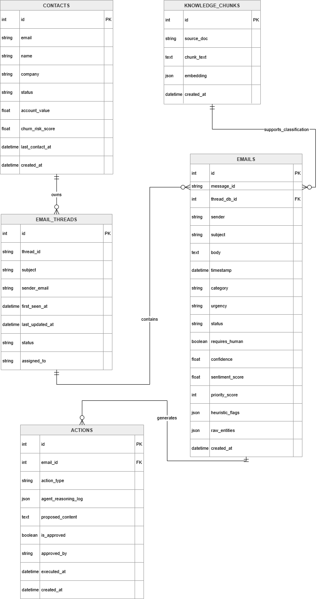

# Agentic CRM Intelligence Platform

A full-stack CRM email intelligence platform for ingesting customer emails, classifying support cases, retrieving relevant policy context, running agent dry-runs, and routing proposed actions through human review.

The system is designed for support and customer-success workflows where incoming emails need to be prioritized, escalated, audited, and reviewed before any customer-facing action is taken.

Git repo: https://github.com/sudhanshu-dave/Agentic-CRM-Intelligence.git

---

## Overview

Agentic CRM Intelligence Platform processes incoming customer emails and organizes them into actionable support workflows.

The backend ingests email events, groups related messages into threads, retrieves relevant internal policy context, classifies each email using an LLM-backed pipeline, applies safety rules, and records agent reasoning traces. The frontend provides a dashboard for inbox triage, analytics, audit inspection, and human review of proposed actions.

The platform does not send customer emails automatically. It creates proposed actions and reply drafts that can be approved or rejected by a human reviewer.

---

## Features

- Email ingestion through FastAPI
- Customer thread grouping
- Contact tracking
- RAG-style policy retrieval
- Groq LLM-based structured classification
- Deterministic fallback classifier
- Category, urgency, sentiment, and priority scoring
- Agent dry-run workflow
- Reasoning trace and audit trail
- Safety checks for legal, security, spam, GDPR, and critical cases
- Human approval and rejection workflow
- Sentiment and category analytics
- React-based dashboard and review interface

---

## Tech Stack

### Backend

- Python
- FastAPI
- SQLAlchemy
- SQLite
- Pydantic
- Groq API through OpenAI-compatible client
- Local policy retrieval for RAG context

### Frontend

- React
- Vite
- Axios
- React Router
- Recharts
- Lucide React

---

## Architecture

The system follows an ingestion-to-review pipeline where emails are processed, enriched with policy context, classified, checked against safety rules, and routed to the UI for review.


```text
Email Stream
    ↓
FastAPI Ingestion
    ↓
SQLite Storage
    ↓
Thread Grouping + Contact Tracking
    ↓
Policy Retrieval
    ↓
Groq LLM Classification
    ↓
Safety Rules + Fallback Classifier
    ↓
Agent Dry Run
    ↓
Audit Trail + Proposed Actions
    ↓
Human Review Queue
    ↓
Analytics Dashboard
```

---

## ER Diagram

The database schema stores emails, threads, contacts, knowledge chunks, and agent actions. JSON fields are used for heuristic flags, extracted entities, embeddings, and reasoning traces.



---

## Safety Approach

The system is built around a human-in-the-loop workflow. It can classify, reason, retrieve policy context, and draft a proposed response, but it does not send emails automatically.

Automatic replies are blocked for:

- Security threats
- Ransomware or extortion emails
- Spam
- Legal threats
- GDPR or privacy requests
- Critical incidents
- SLA breach escalations
- Public review or reputation threats
- Refund or compensation cases requiring approval

Risky cases are escalated and require human review.

---

## Project Structure

```text
agentic-crm-intelligence/
├── backend/
│   ├── app/
│   │   ├── agent/
│   │   ├── api/
│   │   ├── core/
│   │   ├── llm/
│   │   ├── models/
│   │   ├── rag/
│   │   ├── schemas/
│   │   └── services/
│   ├── data/
│   ├── scripts/
│   ├── requirements.txt
│   └── .env.example
│
├── frontend/
│   ├── src/
│   │   ├── api/
│   │   ├── components/
│   │   └── pages/
│   ├── package.json
│   └── vite.config.js
│
├── docs/
│   ├── ER.png
│   ├── System Flow.png
│   ├── architecture.md
│   ├── er-diagram.md
│   └── schema.sql
│
├── migrations/
│   └── 001_initial_schema.sql
│
├── openapi.json
├── README.md
└── .gitignore
```

---

## Backend Setup

From the project root:

```powershell
cd backend
python -m venv ..\venv
..\venv\Scripts\Activate.ps1
pip install -r requirements.txt
```

Create a `.env` file inside the `backend/` directory:

```text
ENABLE_LLM_CLASSIFICATION=true
GROQ_API_KEY=your_groq_key_here
GROQ_MODEL=openai/gpt-oss-20b
GROQ_BASE_URL=https://api.groq.com/openai/v1
```

Start the backend server:

```powershell
cd backend
python -m uvicorn app.main:app --host 127.0.0.1 --port 8001
```

Backend API documentation:

```text
http://127.0.0.1:8001/docs
```

Health check:

```text
http://127.0.0.1:8001/health
```

---

## Frontend Setup

From the project root:

```powershell
cd frontend
npm install
npm run dev
```

Open the frontend:

```text
http://localhost:5173
```

The frontend expects the backend to be running at:

```text
http://127.0.0.1:8001
```

---

## Environment Configuration

The repository includes a sample environment file:

```text
backend/.env.example
```

Example content:

```text
ENABLE_LLM_CLASSIFICATION=true
GROQ_API_KEY=
GROQ_MODEL=openai/gpt-oss-20b
GROQ_BASE_URL=https://api.groq.com/openai/v1
```

The real API key should be stored only in:

```text
backend/.env
```

---

## Data Setup

Seed the internal knowledge base:

```powershell
python backend\scripts\seed_kb.py --reset
```

Simulate the email stream:

```powershell
python backend\scripts\simulate_stream.py --api-url http://127.0.0.1:8001/api/ingest --speed 10
```

Classify all ingested emails:

```powershell
Invoke-RestMethod -Uri "http://127.0.0.1:8001/classify/batch/run?limit=100" `
  -Method Post | ConvertTo-Json -Depth 20
```

---

## Knowledge Base Files

The RAG pipeline is seeded from the internal knowledge base files stored in the backend data directory.

The knowledge base includes:

- Pricing policy
- SLA policy
- Refund policy
- API documentation
- Compliance FAQ
- Escalation matrix

These files are chunked and indexed by the seeding script before classification and agent dry-runs.

---

## API Endpoints

### Health

```text
GET /health
```

### Email Ingestion

```text
POST /api/ingest
GET /api/status/{job_id}
```

### Emails and Threads

```text
GET /emails
GET /threads/{contact_email}
```

### RAG Search

```text
GET /rag/search?q=refund public review&top_k=3
```

### Classification

```text
POST /classify/{email_id}
POST /classify/batch/run
```

### Agent Dry Run

```text
POST /agent/dry-run/{email_id}
```

### Audit

```text
GET /audit/email/{email_id}
GET /audit/thread/{thread_id}
```

### Analytics

```text
GET /analytics/sentiment-trend
GET /analytics/category-breakdown
```

### Human Review

```text
GET /actions/pending
POST /actions/{action_id}/approve
POST /actions/{action_id}/reject
```

---

## Additional Submission Artifacts

The repository includes supporting documentation and generated artifacts:

```text
docs/architecture.md
docs/er-diagram.md
docs/schema.sql
migrations/001_initial_schema.sql
openapi.json
```

- `docs/architecture.md` documents the system flow and architecture decisions.
- `docs/er-diagram.md` documents the database design.
- `docs/schema.sql` contains the exported SQL schema.
- `migrations/001_initial_schema.sql` contains the initial schema migration.
- `openapi.json` contains the exported FastAPI OpenAPI specification.

---

## Demo Dataset Scenarios

The sample dataset includes several customer-support scenarios that demonstrate classification, retrieval, escalation, and human review behavior.

### Bob — SLA Breach and Legal Review

Email ID:

```text
60
```

Expected behavior:

- Category: Legal
- Urgency: Critical
- Status: Escalated
- SLA policy and escalation matrix retrieved
- Human review required
- Auto-reply blocked

Test:

```powershell
Invoke-RestMethod -Uri "http://127.0.0.1:8001/agent/dry-run/60" `
  -Method Post | ConvertTo-Json -Depth 30
```

---

### Ransomware / Security Threat

Email ID:

```text
38
```

Expected behavior:

- Critical urgency
- Security escalation
- No reply draft
- Auto-reply blocked
- Human review required

Test:

```powershell
Invoke-RestMethod -Uri "http://127.0.0.1:8001/agent/dry-run/38" `
  -Method Post | ConvertTo-Json -Depth 30
```

---

### Karen — Refund and Public Review Threat

Email ID:

```text
33
```

Expected behavior:

- Category: Complaint
- Urgency: High
- Refund policy retrieved
- Escalation to support leadership
- No automatic refund promise

Test:

```powershell
Invoke-RestMethod -Uri "http://127.0.0.1:8001/agent/dry-run/33" `
  -Method Post | ConvertTo-Json -Depth 30
```

---

### Alice — Pricing and Pro-Rata Billing

Email ID:

```text
41
```

Expected behavior:

- Category: Inquiry
- Pricing policy retrieved
- Reply draft generated
- Human approval required before sending

Test:

```powershell
Invoke-RestMethod -Uri "http://127.0.0.1:8001/agent/dry-run/41" `
  -Method Post | ConvertTo-Json -Depth 30
```

---

### GDPR Data Portability Request

Email ID:

```text
52
```

Expected behavior:

- Legal or compliance routing
- Critical urgency
- Privacy/legal team escalation
- Generic support reply blocked

Test:

```powershell
Invoke-RestMethod -Uri "http://127.0.0.1:8001/agent/dry-run/52" `
  -Method Post | ConvertTo-Json -Depth 30
```

---

## Frontend Pages

### Dashboard

Displays email volume, contacts, critical cases, escalations, human-review workload, latest emails, and category distribution.

### Inbox

Provides the main triage workspace:

- Paginated email list
- Status and urgency filters
- Selected email detail view
- Agent dry-run trigger
- Audit view trigger
- Thread view trigger
- LLM metadata display
- Proposed reply draft display

### Analytics

Displays:

- Sentiment trend
- Moving average sentiment
- Category breakdown
- Urgency breakdown
- Status breakdown

### Audit / Agent

Displays:

- Email audit trail
- Heuristic flags
- Saved agent actions
- Reasoning trace
- Proposed reply content

### Human Review

Displays pending agent actions and allows a reviewer to approve or reject them.

---

## LLM and Fallback Behavior

The backend uses Groq as the primary LLM provider:

```text
Provider: groq
Model: openai/gpt-oss-20b
```

The LLM is used for structured classification with retrieved policy context.

If the LLM call fails, the system records the error reason and uses a deterministic fallback classifier. This keeps the application usable when the LLM provider is unavailable or returns an invalid response.

Fallback cases include:

- Missing API key
- API quota issues
- Timeout
- Invalid model response
- JSON parsing issue
- Network failure

---

## Human Approval Workflow

The agent creates proposed actions in dry-run mode.

A reviewer can inspect pending actions:

```text
GET /actions/pending
```

Approve an action:

```text
POST /actions/{action_id}/approve
```

Reject an action:

```text
POST /actions/{action_id}/reject
```

The backend prevents conflicting review decisions:

- Approved actions cannot be rejected later
- Rejected actions cannot be approved later
- Only pending actions appear in the pending queue

---

## Architecture Decisions and Trade-offs

SQLite is used for local development and simple evaluation setup. For production deployment, PostgreSQL with pgvector or a managed vector database would be a better fit for scalable relational and vector search workloads.

The RAG pipeline uses local knowledge-base files to avoid external infrastructure. This keeps the project reproducible while still demonstrating retrieval-augmented classification.

The agent follows a dry-run design. It proposes actions and drafts but does not execute customer-facing communication directly. This design keeps legal, compliance, security, and high-risk support workflows under human control.

A deterministic fallback classifier is included so that the system continues to function even if the LLM provider is unavailable or returns an invalid response.

---

## Known Limitations

- The current implementation uses SQLite for local persistence.
- The vector store is implemented locally rather than through a production vector database.
- Web intelligence is represented as a controlled demo/enrichment layer and can be replaced with a real scraper or external reputation API.
- The platform does not send actual emails.
- The approval workflow records review decisions but does not integrate with external ticketing, CRM, or email systems.

---

## Environment and Repository Hygiene

Runtime configuration is handled through environment variables.

The real `.env` file stays local. A sample configuration is provided in:

```text
backend/.env.example
```

Recommended ignored files and folders:

```gitignore
.env
backend/.env
frontend/.env
venv/
__pycache__/
*.pyc
backend/agentic_crm.db
```

---

## Implementation Status

Implemented:

- FastAPI backend
- React frontend
- Email ingestion
- Thread grouping
- Contact tracking
- RAG retrieval
- Groq LLM structured classification
- Deterministic fallback classifier
- Safety rules
- Agent dry-run workflow
- Audit trail
- Analytics endpoints
- Human approval and rejection workflow
- Human review frontend page
- Inbox workspace with pagination and agent actions